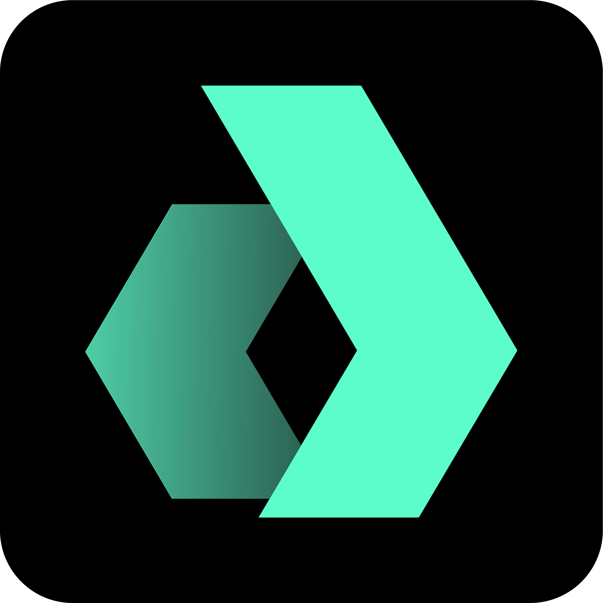

# Liquid Protocol • [](https://github.com/daobox/liquid-protocol/actions/workflows/tests.yml) [](https://github.com/daobox/liquid-protocol/actions/workflows/lints.yml)  


a governance protocol designed to empower creatives and commintites by coordinating incentive alignment with their stakeholders. Drawing heavy inspiration from [Continuous Organizations](https://github.com/C-ORG/whitepaper#challenges), our protocol introduces a model for DAOs by merging token bonding curves, market making, governance into a single, cohesive entity.

At its core, the Liquid Protocol facilitates the creation of Continuous Organizations, entities that operate with continuous financing and strong stakeholder alignment, all underpinned by a unique native token. This token, apart from serving as a store of value, also confers governance rights in the associated DAO, creating a harmonious feedback loop between financial and decision-making power.

The protocol enables any inderviduals or associan to set up a continuous funding mechanism and maintain a liquidity pool of orgnisations native asset, regardless of the size of its market. This mechanism aligns the financial interests of all stakeholders - founders, employees, investors, and the broader community.

In essence, Liquid Protocol paves the way for a new wave of DAOs where stakeholders can invest in an organization at any given time, capture the value they help generate, and where their financial and decision-making interests are fully aligned with the success of the organization.

This repo contains the smart contracts, interfaces, and libraries that underpin Liquid Protocol. We invite you to explore the protocol, interact with the codebase, and join us in our journey towards redefining organizational structures for the decentralized world. Your contributions are more than welcome.

<br>

## Blueprint

```ml
└── src
    ├── core
    │   ├── ContinuousDaoSetup.sol
    │   ├── GovernanceBurnableERC20.sol
    │   ├── MarketMaker.sol
    │   ├── SimpleHatch.sol
    │   └── Vesting.sol
    ├── interfaces
    │   ├── IBondedToken.sol
    │   ├── IBondingCurve.sol
    │   └── IHatch.sol
    ├── lib
    │   ├── Errors.sol
    │   ├── Events.sol
    │   └── Types.sol
    ├── math
    │   ├── BancorBondingCurve.sol
    │   ├── BancorFormula.sol
    │   └── Power.sol
    ├── mocks
    │   └── MockBondedToken.sol
    ├── modifiers
        ├── MarketMaker.sol
        ├── SimpleHatch.sol
        └── Vesting.sol
```

## Development

**Building**

```bash
forge build
```

**Testing**

```bash
forge test -vvvvv
```


### First time with Forge/Foundry?

See the official Foundry installation [instructions](https://github.com/gakonst/foundry/blob/master/README.md#installation).

Then, install the [foundry](https://github.com/gakonst/foundry) toolchain installer (`foundryup`) with:

```bash
curl -L https://foundry.paradigm.xyz | bash
```

Now that you've installed the `foundryup` binary,
anytime you need to get the latest `forge` or `cast` binaries,
you can run `foundryup`.

So, simply execute:

```bash
foundryup
```

🎉 Foundry is installed! 🎉


## License

[MIT](https://github.com/daobox/liquid-protocol/blob/master/LICENSE)


## Disclaimer

> The Protocol is a work in progress, subject to change, and provided "AS IS", without warranty of any kind, express or implied, including but not limited to the warranties of merchantability, fitness for a particular purpose, and non-infringement. In no event shall the authors or copyright holders be liable for any claim, damages, or other liability, whether in an action of contract, tort, or otherwise, arising from, out of, or in connection with the software or the use or other dealings in the software. All use of this protocol and deployment of these smart contracts are at the user's own risk. Users should ensure they comply with all laws and regulations in their respective jurisdictions before using or deploying these contracts. The creators and contributors to this protocol are not responsible for any losses or damages incurred as a result of using or deploying these contracts.